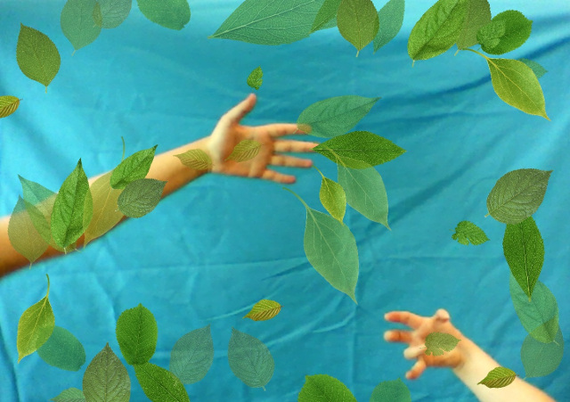

#Webcam Overlays in HTML and JavaScript

##Introduction

The Digital Humanities Hub hold regular events for anyone interested in their work, which are known as CAKE events. The July 2016 CAKE topic of 'Digital Landscapes' included a keynote talk by artist Jaime Jackson of Salt Road. Based on work he has been doing he came up with a concept for interactive art where people can create a picture of themselves overlayed with leaves that they can position and resize to build their own artwork. So the Digital Humanities Hub collaborated with Jaime to build a web-based system to allow them to do just that. As well as being able to create their atwork, we also coded the system to allow the resulting images to be downloaded. As you can see in the example below, people had a lot of creative fun with it at our CAKE.

##Using the code on your own website

To use the code you'll need some images to overlay on the webcam feed (and, of course, a webcam), as well as a computer or tablet that has a touch screen (e.g. many PCs now have a touch screen, or you can use an iPad or Android tablet). Jaime used very nice images he made of leaves with varying opacity, as you can see in the above image. You don't have to do the same though, as you can use any images you wish: from aliens to dinosaurs, or flowers to animals. It's only limited to your imagination and you should find you can use tens of different images without the page slowing to a crawl.

We found that a maximum size of around 500 pixels was good for the overlay-images we used, as generally webcam images aren't high resolution and it meant we could use lots of leaves without affecting performace. Also, the images can be pretty much any normal web format such as jpeg, png or gif, and you can mix and match different image file types. When you've prepared them you can just copy them to the same folder as the code provided here. Then, open the index.html file in a text editor (we like Notepad++, but any plain text editor should be good) and edit the list of images to include your file names.

Because it's JavaScript you need to put the file names in quotes and have a comma after each one (except the last on). To make that easier to understand you'll notice we've included two images in the list already (the Digital Humanities Hub logo and a football - well, the CAKE was during Euro 2016 after all), so just follow the same format. Then, when you've uploaded it to a folder on your webspace, you can open it in a browser. Don't forget to put https:// at the start of the address if your browser needs a secure connection, rather than just http:// or simply www.

Once you've got the page up and running, with a live webcam feed on display, using the code is easy and straightforward. Initially you'll see a video view, so people can get themselves in position. Then someone clicks the camera button and the page will switch to a static image (it changes to a video button you can use to go back to the live feed). In static-image mode you'll notice the download button appears in the top-right of the screen, which you can use to save a copy of the artwork to your computer. And that's all there is to it, except for having some fun including yourself in your artwork.

## A note about webcams and browser security

The code is written for modern HTML5 web browsers, which means any major and up-to-date browser should handle it (e.g. Chrome, Firefox, Edge). However, for security reaons some browsers will only let you display a webcam feed over a secure HTTPS connection, and then only if you agree to let the page use it by clicking a button in a security dialog (that should pop up when you open the page with the webcam attached, and it should only happen the first time). So, if you find the webcam feed doesn't appear you'll need to use an SSL certificate to ensure the web connection is encrypted. If you don't know how to do that then you can ask your IT people or whoever hosts your website/server (or go to the control panel for your web hosting, which should let you buy one). An SSL certificate is relatively inexpensive and can help increase prominence in search engine results, so if you need one then it isn't the end of the world.

##About the Digital Humanities Hub

The Digital Humanities Hub focuses on collaborative triple helix working across the Arts and Humanities with cultural and heritage organisations, digital and creative industries and academics to develop collaborative and innovative digital prototypes. It is based on the University of Birmingham's Edgbaston Campus in the UK and you can visit the Hub's website at http://www.birmingham.ac.uk/facilities/digitalhumanitieshub/index.aspx

##Use and licensing

The code here is licensed open-source under the permissive MIT license (see the LICENSE file on this repository) to enable you to make full use of it in your own web and art installations. The only other requirement is that you have some fun using our code :-)

##Credits

This piece of work was inspired and motivated by collaboration with Jaime Jackson of Salt Road. you can see his work at http://www.saltroad.org.uk/ and http://www.jaimejackson.org/.

Concept and development by Jaime Jackson from Salt Road, and Lara Ratnaraja and Andrew Thomas from the Digital Humanities Hub. Coding by Andrew Thomas.

